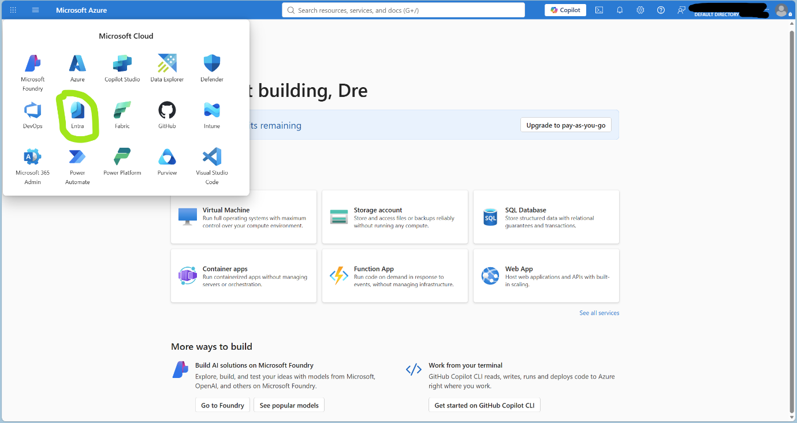
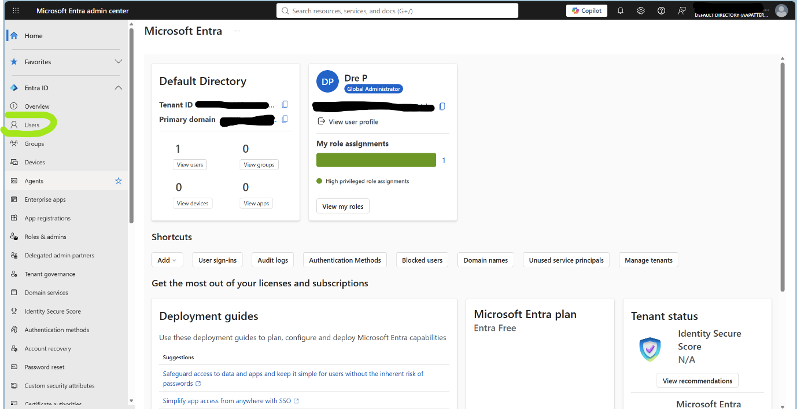
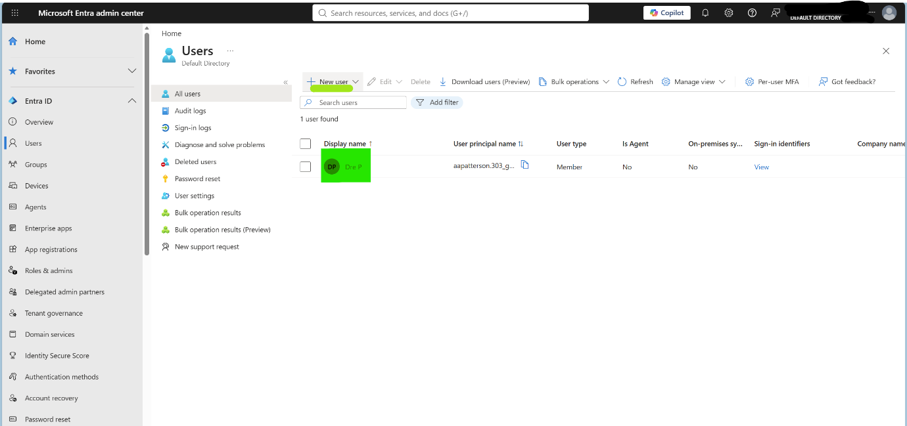
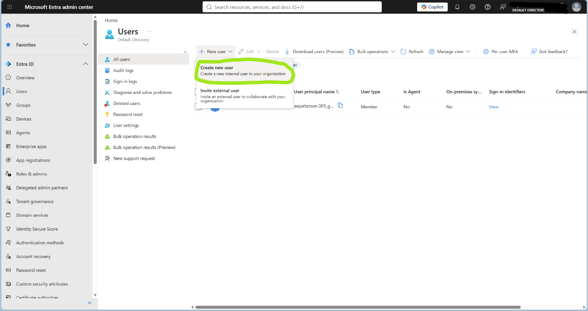
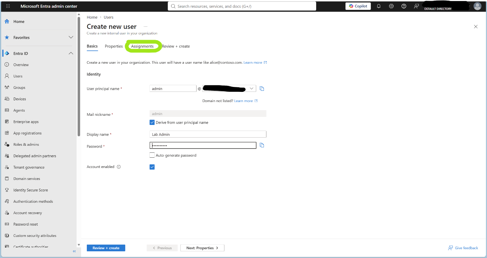
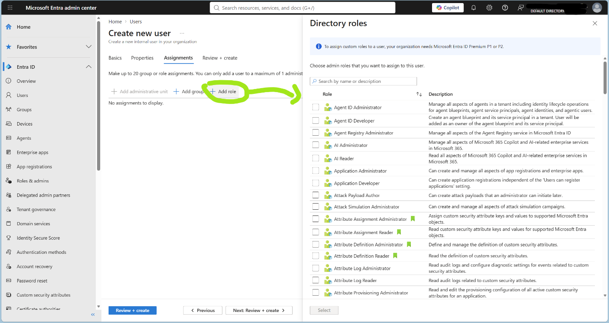
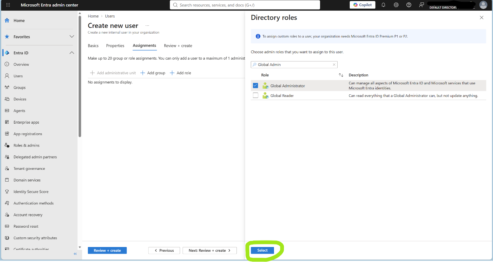
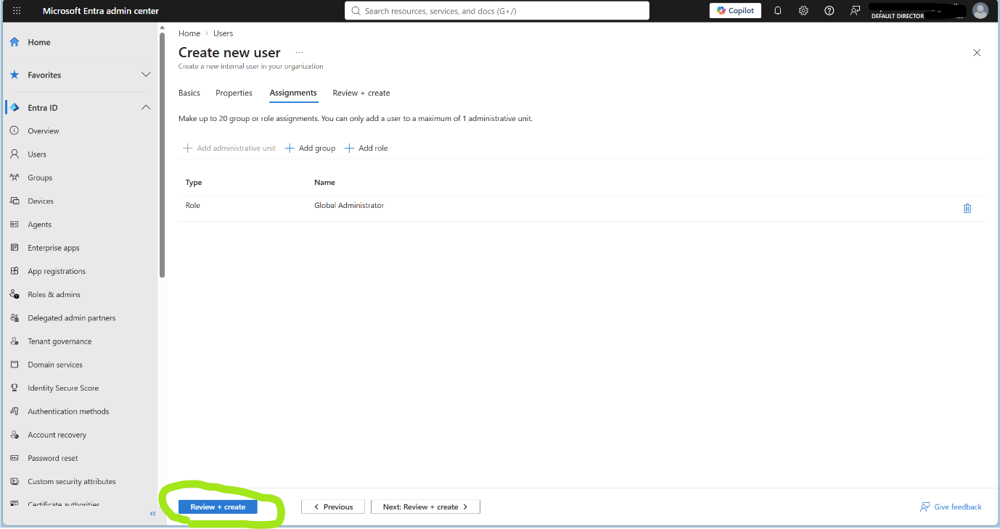
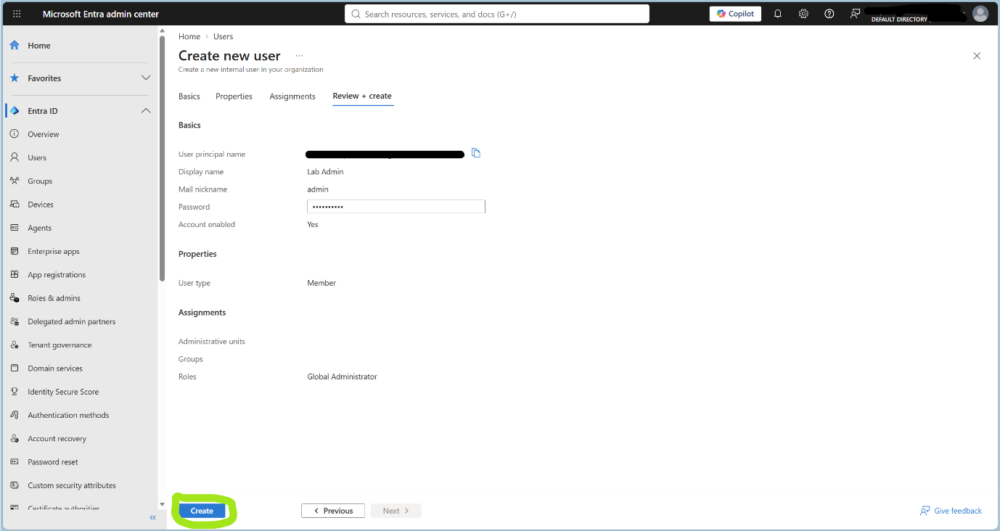

# 📄 Lab Notes: SC-200 Microsoft 365 Security Tenant

- **Author**: Andre Patterson
- **Environment**: Microsoft 365 E5 Trial | Microsoft Entra ID | Default Directory
- **Course**: Microsoft SC-200 – Security Operations Analyst (Udemy)

--------------------------------------------------------------------------------------------------------------------------------------------------------------------------------------------

## Lab 1 — Microsoft 365 Tenant & Entra ID Setup

**Objective**: Stand up the tenant and establish the Entra ID identity foundation everything else builds on.

**Step 1 — Navigate to Entra ID**
From the Microsoft Azure homepage, selected the top left menu icon, then selected Entra.

**Step 2 — Open Users**
Selected **Users** from the Entra ID navigation.
 

**Step 3 — Create New User**
Selected **+ New user** icon, 

then **Create new user**.

**Step 4 — Assign Directory Role**
Selected **Assignments**, 

then **+ Add role**, which displayed the Directory roles panel.

**Step 5 — Select Global Administrator**
Searched "Global Admin" in the search field, selected the **Global Administrator** box (blue tick displayed), then clicked **Select**.

**Step 6 — Review and Create**
Selected **Review + create** to confirm the new admin account configuration.

then click **Create**.

Lab 1 complete ✅

--------------------------------------------------------------------------------------------------------------------------------------------------------------------------------------------

## Lab 2 — Microsoft 365 E5 Trial & Domain Configuration

**Objective**: Provision the E5 licence tier required for Defender XDR, Sentinel integrations and other security tooling.

